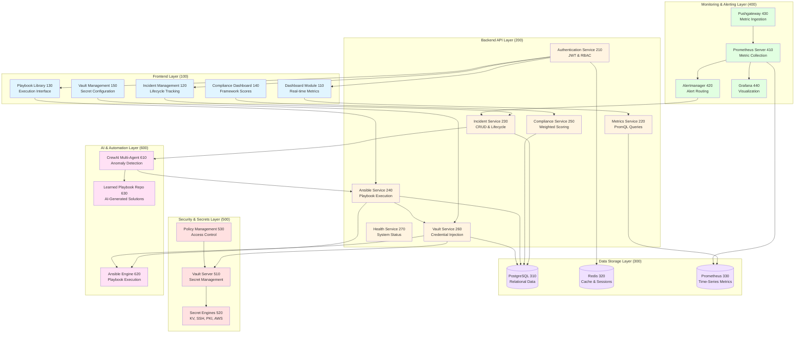

# Figure 1: System Architecture Overview

## Component Descriptions

### Frontend Layer (100)
- **Dashboard Module (110)**: React-based UI displaying real-time metrics, regional breakdown, and top incidents
- **Incident Management (120)**: Interface for incident creation, assignment, acknowledgment, and resolution
- **Playbook Library (130)**: Categorized playbook listing with execution history and dry-run capabilities
- **Compliance Dashboard (140)**: Framework scores, control-level details, and remediation recommendations
- **Vault Management (150)**: Secret path configuration, Ansible integrations, and policy viewer

### Backend API Layer (200)
- **Authentication Service (210)**: JWT token issuance, refresh, RBAC enforcement
- **Metrics Service (220)**: PromQL query generation, regional filtering, metric aggregation
- **Incident Service (230)**: CRUD operations, lifecycle management, playbook linking
- **Ansible Service (240)**: Playbook discovery, execution orchestration, Vault integration
- **Compliance Service (250)**: Severity-weighted scoring, automated evaluation, audit logging
- **Vault Service (260)**: Secret retrieval, credential injection, access auditing
- **Health Service (270)**: Component health checks (Prometheus, PostgreSQL, Redis, Vault)

### Data Storage Layer (300)
- **PostgreSQL (310)**: Incidents, compliance controls, playbook executions, audit logs
- **Redis (320)**: Session cache, real-time incident status, metric lookups
- **Prometheus (330)**: 90-day metric retention, 15-second resolution, PromQL queries

### Monitoring & Alerting Layer (400)
- **Prometheus Server (410)**: Metric scraping, alert rule evaluation, time-series storage
- **Alertmanager (420)**: Alert grouping, deduplication, webhook delivery to Incident Service
- **Pushgateway (430)**: Batch job metrics, test data ingestion, external source integration
- **Grafana (440)**: Interactive dashboards, embedded visualizations, alert history

### Security & Secrets Layer (500)
- **Vault Server (510)**: HashiCorp Vault in production mode with TLS
- **Secret Engines (520)**: KV v2, SSH, PKI, AWS, Transit, Database engines
- **Policy Management (530)**: Three role-based policies (ansible, app, admin)

### AI & Automation Layer (600)
- **CrewAI Multi-Agent (610)**: Three agents (Anomaly Detector, Playbook Matcher, LLM Consultant)
- **Ansible Engine (620)**: Playbook execution with credential injection, output capture
- **Learned Playbook Repository (630)**: Persistent storage for AI-generated playbooks with metadata
