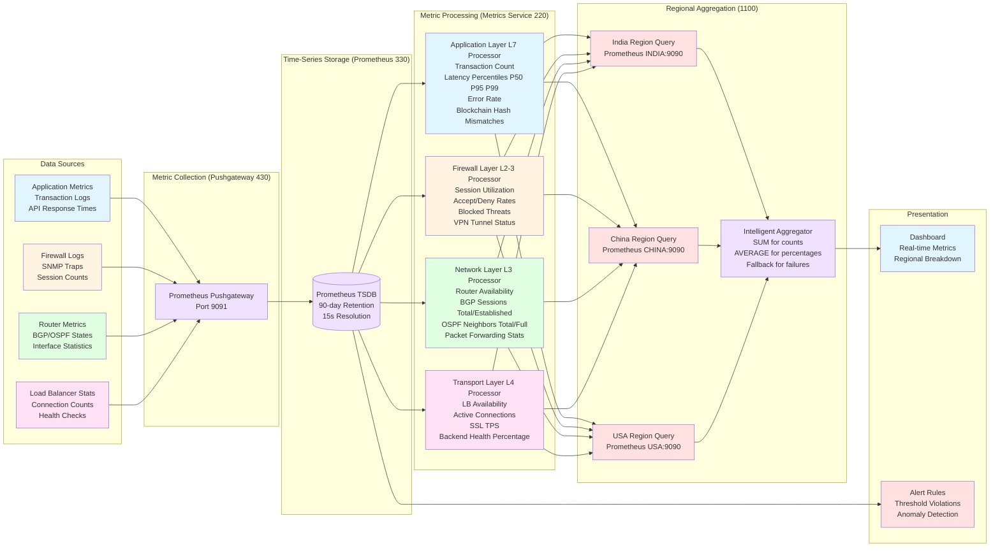

# Figure 2: Multi-Layer Network Monitoring Data Flow



## Layer-Specific Metrics

### Application Layer (L7) - Metrics 700

#### Transaction Volume Metrics (710)
```promql
# Total transaction count
sum(noc_transaction_count_total{region="india"})

# Success rate
(sum(noc_transaction_success_total) / sum(noc_transaction_count_total)) * 100

# Error rate
(sum(noc_transaction_failure_total) / sum(noc_transaction_count_total)) * 100
```

#### Latency Metrics (720)
```promql
# P50 Latency (50th percentile)
histogram_quantile(0.50,
    sum(rate(noc_transaction_latency_bucket{region="india"}[5m])) by (le)
) * 1000

# P95 Latency (95th percentile)
histogram_quantile(0.95,
    sum(rate(noc_transaction_latency_bucket{region="india"}[5m])) by (le)
) * 1000

# P99 Latency (99th percentile)
histogram_quantile(0.99,
    sum(rate(noc_transaction_latency_bucket{region="india"}[5m])) by (le)
) * 1000
```

#### Throughput Metrics (730)
```promql
# Transactions per second
rate(noc_transaction_count_total{region="india"}[1m])
```

#### Blockchain-Specific Metrics (740)
```promql
# Hash mismatch count (crypto validation failures)
sum(noc_blockchain_hash_mismatch_total{region="india"})

# Blockchain node failures
sum(noc_blockchain_node_failures_total{region="india"})
```

---

### Firewall Layer (L2-3) - Metrics 800

#### Session Metrics (810)
```promql
# Active sessions
sum(noc_firewall_sessions_active{region="india"})

# Session utilization %
(sum(noc_firewall_sessions_active) / sum(noc_firewall_sessions_max)) * 100
```

#### Traffic Decision Metrics (820)
```promql
# Accepts per second
rate(noc_firewall_accepts_total{region="india"}[1m])

# Denies per second
rate(noc_firewall_denies_total{region="india"}[1m])

# Deny rate %
(sum(noc_firewall_denies_total) /
 (sum(noc_firewall_accepts_total) + sum(noc_firewall_denies_total))) * 100
```

#### Security Metrics (830)
```promql
# Blocked threats
sum(noc_firewall_blocked_threats_total{region="india"})

# VPN tunnels active
sum(noc_firewall_vpn_tunnels_active{region="india"})
```

#### Performance Metrics (840)
```promql
# CPU usage %
avg(noc_firewall_cpu_usage_percent{region="india"})

# Memory usage %
avg(noc_firewall_memory_usage_percent{region="india"})

# Throughput Mbps
sum(noc_firewall_throughput_mbps{region="india"})
```

---

### Network Layer (L3) - Metrics 900

#### Device Availability (910)
```promql
# Total routers
count(noc_router_up{region="india"})

# Routers up
sum(noc_router_up{region="india"})

# Router CPU/Memory
avg(noc_router_cpu_usage_percent{region="india"})
avg(noc_router_memory_usage_percent{region="india"})
```

#### BGP Protocol Metrics (920)
```promql
# BGP sessions total
sum(noc_router_bgp_sessions_total{region="india"})

# BGP sessions established
sum(noc_router_bgp_sessions_established{region="india"})

# BGP routes
sum(noc_router_routes_bgp{region="india"})
```

#### OSPF Protocol Metrics (930)
```promql
# OSPF neighbors total
sum(noc_router_ospf_neighbors_total{region="india"})

# OSPF neighbors in FULL state
sum(noc_router_ospf_neighbors_full{region="india"})

# OSPF routes
sum(noc_router_routes_ospf{region="india"})
```

#### Forwarding Metrics (950)
```promql
# Packets forwarded
sum(rate(noc_router_packets_forwarded_total{region="india"}[5m]))

# Packets dropped
sum(rate(noc_router_packets_dropped_total{region="india"}[5m]))

# Drop rate %
(dropped / (forwarded + dropped)) * 100
```

---

### Transport Layer (L4) - Metrics 1000

#### Load Balancer Availability (1010)
```promql
# Total load balancers
count(noc_load_balancer_up{region="india"})

# LBs up
sum(noc_load_balancer_up{region="india"})
```

#### Connection Metrics (1020)
```promql
# Active connections
sum(noc_load_balancer_connections_active{region="india"})

# Connections per second
rate(noc_load_balancer_connections_total{region="india"}[1m])

# Bandwidth Mbps
sum(noc_load_balancer_bandwidth_mbps{region="india"})
```

#### SSL/TLS Metrics (1030)
```promql
# SSL transactions per second
rate(noc_load_balancer_ssl_transactions_total{region="india"}[1m])

# SSL handshakes
sum(noc_load_balancer_ssl_handshakes_total{region="india"})
```

#### Backend Health Metrics (1040)
```promql
# Total backend servers
sum(noc_load_balancer_backends_total{region="india"})

# Healthy backends
sum(noc_load_balancer_backends_healthy{region="india"})

# Backend health %
(healthy / total) * 100

# Health check failures
sum(noc_load_balancer_health_check_failures_total{region="india"})
```

---

## Regional Aggregation Algorithm (1100)

### Parallel Query Pattern
```python
async def aggregate_regional_metrics():
    """
    Query all regions in parallel with fault tolerance
    """
    regions = ["india", "china", "usa"]
    tasks = []

    # Launch parallel queries
    for region in regions:
        task = query_prometheus(
            url=f"http://prometheus-{region}:9090",
            query=f'noc_transaction_count_total{{region="{region}"}}',
            timeout=5.0
        )
        tasks.append(task)

    # Gather results with exception handling
    results = await asyncio.gather(*tasks, return_exceptions=True)

    # Process results
    regional_metrics = []
    for i, region in enumerate(regions):
        if isinstance(results[i], Exception):
            # Use fallback for unavailable region
            logger.warning(f"Region {region} unavailable: {results[i]}")
            regional_metrics.append(FallbackMetrics(region=region))
        else:
            regional_metrics.append(results[i])

    # Aggregate
    global_count = sum(m.transaction_count for m in regional_metrics)
    global_latency = statistics.mean(m.avg_latency for m in regional_metrics)

    return GlobalMetrics(
        transaction_count=global_count,
        avg_latency=global_latency,
        regions=regional_metrics
    )
```

### Aggregation Rules

| Metric Type | Aggregation Method | Example |
|-------------|-------------------|---------|
| **Counts** (transactions, sessions, routes) | **SUM** | `global_transactions = india + china + usa` |
| **Percentages** (CPU, memory, utilization) | **AVERAGE** | `global_cpu = (india + china + usa) / 3` |
| **Rates** (TPS, errors/sec, packets/sec) | **SUM** | `global_tps = india_tps + china_tps + usa_tps` |
| **Latencies** (P50, P95, P99) | **WEIGHTED AVERAGE** | `global_p99 = (india_p99*india_txns + ...) / total_txns` |

### Consistency Validation
```python
# Ensure global equals sum of regional
assert global_metrics.transaction_count == \
    sum(r.transaction_count for r in regional_metrics)

assert global_metrics.routers_up == \
    sum(r.routers_up for r in regional_metrics)
```
