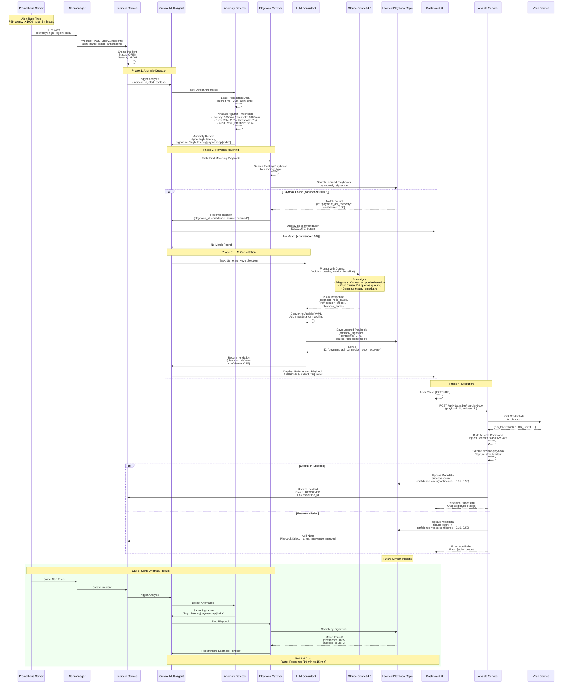

# Figure 3: Self-Learning Incident Remediation Flow



## Process Phases

### Phase 1: Incident Detection (1200-1220)

**Alert Generation (1210)**
- Prometheus evaluates rules every 15 seconds
- Alert fires when condition met for `for:` duration (5 minutes)
- Alertmanager receives alert and sends webhook

**Incident Creation (1220)**
```python
incident = Incident(
    id=generate_uuid(),
    title="High Transaction Latency in India",
    description="P99 latency exceeds 1000ms",
    severity=IncidentSeverity.HIGH,
    status=IncidentStatus.OPEN,
    region="india",
    service="payment-api",
    root_cause_hypothesis="High latency detected, investigating...",
    alert_fingerprint=alert_fingerprint,
    created_at=datetime.utcnow()
)
```

---

### Phase 2: Anomaly Analysis (1300-1320)

**CrewAI Initialization (1310)**
```python
crew = Crew(
    agents=[
        anomaly_detector_agent,
        playbook_matcher_agent,
        llm_consultant_agent
    ],
    process=Process.SEQUENTIAL,
    manager_llm=claude_sonnet_4_5
)
```

**Anomaly Detection (1320)**
```python
anomaly_report = {
    "anomaly_type": "high_latency",
    "severity": "high",
    "affected_transactions": 1250,
    "p99_latency": 1850,  # ms
    "threshold": 1000,     # ms
    "additional_context": {
        "error_rate": "2.3%",
        "cpu_usage": "78%",
        "db_connections": "245/250 (98%)"
    },
    "signature": "high_latency|payment-api|india"
}
```

---

### Phase 3: Playbook Matching (1400-1430)

**Search Strategy**
1. Search existing playbooks by anomaly type (confidence: 0.9)
2. Search learned playbooks by signature (confidence: 0.8)
3. If max(confidence) >= 0.8: recommend playbook
4. Else: proceed to LLM consultation

**Example Match**
```python
learned_playbook = LearnedPlaybook(
    id="payment_api_connection_pool_recovery",
    anomaly_signature="high_latency|payment-api|india",
    confidence=0.85,
    execution_count=3,
    success_count=3,
    failure_count=0,
    last_execution_date=datetime(2024, 1, 15)
)
```

---

### Phase 4: LLM Consultation (1500-1540)

**Prompt Construction (1510)**
```
You are an expert NOC engineer analyzing a production incident.

INCIDENT DETAILS:
- Type: High Transaction Latency
- Region: India
- Service: payment-api
- Severity: HIGH

METRICS AT INCIDENT TIME:
- P99 Latency: 1850ms (threshold: 1000ms)
- Error Rate: 2.3%
- CPU: 78%
- Memory: 65%
- DB Connections: 245/250 (98% utilization)

BASELINE (NORMAL):
- P99 Latency: 150ms
- Error Rate: 0.5%
- DB Connections: 120/250 (48%)

Please provide remediation in JSON format:
{
  "diagnosis": "...",
  "root_cause": "...",
  "remediation_steps": [...],
  "playbook_name": "...",
  "requires_approval": true/false,
  "estimated_recovery_time": "X minutes"
}
```

**LLM Response (1520)**
```json
{
  "diagnosis": "Database connection pool exhaustion",
  "root_cause": "Connection pool maxed at 250, queries waiting",
  "remediation_steps": [
    {
      "step": 1,
      "action": "Check connection count",
      "command": "SELECT count(*) FROM pg_stat_activity",
      "is_destructive": false
    },
    {
      "step": 2,
      "action": "Identify long queries",
      "command": "SELECT pid, query_start FROM pg_stat_activity WHERE ...",
      "is_destructive": false
    },
    {
      "step": 3,
      "action": "Terminate long queries",
      "command": "SELECT pg_terminate_backend(pid) ...",
      "is_destructive": true
    },
    {
      "step": 4,
      "action": "Restart API service",
      "command": "systemctl restart payment-api",
      "is_destructive": true
    },
    {
      "step": 5,
      "action": "Verify recovery",
      "command": "curl http://payment-api/health",
      "is_destructive": false
    }
  ],
  "playbook_name": "payment_api_connection_pool_recovery",
  "requires_approval": true,
  "estimated_recovery_time": "10 minutes"
}
```

**Save Learned Playbook (1530-1540)**
- Convert JSON to Ansible YAML
- Add metadata (signature, confidence, creation date)
- Save to `./learned_playbooks/{name}.yml`
- Create database record for future matching

---

### Phase 5: Execution (1600-1620)

**Vault Credential Injection**
```python
# Fetch from Vault
credentials = vault_service.fetch_secrets(
    paths=["secret/data/nexusguard/database"]
)

# Inject as environment variables
env = {
    "DB_HOST": credentials["host"],
    "DB_USER": credentials["username"],
    "DB_PASSWORD": credentials["password"]
}

# Execute ansible-playbook with credentials
process = subprocess.run(
    ["ansible-playbook", playbook_path, "-e", extra_vars],
    env=env,
    capture_output=True
)
```

**Success Metrics Update**
```python
if execution.status == SUCCESS:
    learned_playbook.success_count += 1
    learned_playbook.confidence = min(confidence + 0.05, 0.95)
else:
    learned_playbook.failure_count += 1
    learned_playbook.confidence = max(confidence - 0.10, 0.50)
```

---

### Phase 6: Self-Learning Demonstration

**Timeline Comparison**

| Event | Day 1 (Initial) | Day 8 (Learned) |
|-------|----------------|-----------------|
| **Anomaly Detected** | 14:30 UTC | 09:15 UTC |
| **Playbook Match** | None found | Confidence: 0.85 |
| **LLM Consultation** | 5 minutes | Not needed |
| **Playbook Execution** | 10 minutes | 10 minutes |
| **Total MTTR** | 15 minutes | 10 minutes |
| **LLM API Cost** | $0.50 | $0.00 |

**Improvement**:
- 33% faster resolution
- 100% cost savings on LLM calls
- Increased confidence from repeated success

**Scalability**:
- After 10 similar incidents handled, playbook becomes highly trusted
- Can enable auto-execution for confidence > 0.90
- Reduces NOC engineer workload by 80% for recurring issues
