# Figure 5: Compliance Scoring Algorithm

```mermaid
flowchart TD
    Start([Start: Calculate Framework Score])

    LoadFramework[Load Compliance Framework<br/>e.g., PCI-DSS v4.0]
    LoadControls[Load All Controls<br/>16 controls for PCI-DSS]

    InitVars[Initialize:<br/>total_weighted_score = 0<br/>total_weight = 0]

    LoopStart{For Each<br/>Control}

    GetStatus[Get Control Status<br/>compliant / partial / non_compliant /<br/>pending_review / not_applicable]

    CheckNA{Status =<br/>not_applicable?}

    SkipControl[Skip Control<br/>Exclude from calculation]

    GetSeverity[Get Control Severity<br/>critical / high / medium / low / info]

    LookupWeight[Lookup Severity Weight<br/>CRITICAL: 5<br/>HIGH: 4<br/>MEDIUM: 3<br/>LOW: 2<br/>INFO: 1]

    LookupScore[Lookup Status Score<br/>COMPLIANT: 100<br/>PARTIAL: 50<br/>PENDING_REVIEW: 25<br/>NON_COMPLIANT: 0]

    Calculate[Calculate Weighted Score<br/>weighted_score = status_score × severity_weight<br/>Add to total_weighted_score<br/>Add weight to total_weight]

    LoopEnd{More<br/>Controls?}

    CalcFinalScore[Calculate Final Score<br/>framework_score =<br/>total_weighted_score / total_weight × 100]

    DetermineStatus[Determine Overall Status:<br/>- If any NON_COMPLIANT → NON_COMPLIANT<br/>- Else if any PARTIAL → PARTIAL<br/>- Else if any PENDING → PENDING_REVIEW<br/>- Else → COMPLIANT]

    SaveScore[Save Framework Score<br/>& Overall Status]

    AutoCheck{Has Automated<br/>Check?}

    RunCheck[Run Prometheus Query<br/>Compare metric to threshold]

    UpdateControl[Update Control Status<br/>based on check result]

    CreateAudit[Create Audit Log Entry<br/>old_status, new_status,<br/>metric_value, timestamp]

    LinkPlaybook{Non-Compliant<br/>Control?}

    ShowRemediation[Display Remediation Playbook<br/>One-Click Execution]

    End([End: Score Calculated])

    %% Flow
    Start --> LoadFramework
    LoadFramework --> LoadControls
    LoadControls --> InitVars
    InitVars --> LoopStart

    LoopStart -->|Yes| GetStatus
    GetStatus --> CheckNA

    CheckNA -->|Yes| SkipControl
    SkipControl --> LoopEnd

    CheckNA -->|No| GetSeverity
    GetSeverity --> LookupWeight
    LookupWeight --> LookupScore
    LookupScore --> Calculate
    Calculate --> LoopEnd

    LoopEnd -->|Yes| LoopStart
    LoopEnd -->|No| CalcFinalScore

    CalcFinalScore --> DetermineStatus
    DetermineStatus --> SaveScore
    SaveScore --> AutoCheck

    AutoCheck -->|Yes| RunCheck
    RunCheck --> UpdateControl
    UpdateControl --> CreateAudit
    CreateAudit --> LinkPlaybook

    AutoCheck -->|No| LinkPlaybook

    LinkPlaybook -->|Yes| ShowRemediation
    LinkPlaybook -->|No| End

    ShowRemediation --> End

    %% Styling
    style Start fill:#e1f5ff
    style LoadFramework fill:#fff4e1
    style LoadControls fill:#fff4e1
    style InitVars fill:#f0e1ff

    style LoopStart fill:#ffe1f5
    style GetStatus fill:#fff4e1
    style CheckNA fill:#ffe1f5
    style SkipControl fill:#ffcccc

    style GetSeverity fill:#fff4e1
    style LookupWeight fill:#e1ffe1
    style LookupScore fill:#e1ffe1
    style Calculate fill:#f0e1ff

    style CalcFinalScore fill:#ffe1e1
    style DetermineStatus fill:#ffe1e1
    style SaveScore fill:#e1f5ff

    style AutoCheck fill:#ffe1f5
    style RunCheck fill:#e1ffe1
    style UpdateControl fill:#fff4e1
    style CreateAudit fill:#f0e1ff

    style LinkPlaybook fill:#ffe1f5
    style ShowRemediation fill:#e1ffe1

    style End fill:#e1f5ff
```



## Scoring Algorithm Details

### Severity Weight Assignment (2500)

```python
SEVERITY_WEIGHTS = {
    ComplianceSeverity.CRITICAL: 5,  # Highest impact
    ComplianceSeverity.HIGH: 4,
    ComplianceSeverity.MEDIUM: 3,
    ComplianceSeverity.LOW: 2,
    ComplianceSeverity.INFO: 1       # Lowest impact
}
```

**Rationale**:
- Critical controls (encryption, access control, authentication) have 5x the weight of informational controls (documentation, policy updates)
- Ensures security-critical failures significantly impact overall score
- Aligns with risk-based compliance approach

---

### Status Score Mapping (2520)

```python
STATUS_SCORES = {
    ComplianceStatus.COMPLIANT: 100,      # Full credit (100%)
    ComplianceStatus.PARTIAL: 50,         # Half credit (50%)
    ComplianceStatus.PENDING_REVIEW: 25,  # Provisional credit (25%)
    ComplianceStatus.NON_COMPLIANT: 0,    # No credit (0%)
    ComplianceStatus.NOT_APPLICABLE: None # Excluded from calculation
}
```

**Innovation**: The **PARTIAL** status is novel compared to prior art systems that only support binary pass/fail. This allows nuanced scoring for controls that are partially implemented.

**Example**:
- PCI-DSS 8.3 (Multi-Factor Authentication)
  - 95% of users have MFA enabled
  - Traditional system: FAIL (not 100%)
  - NexusGuard: PARTIAL (gives 50% credit)
  - Reflects real-world partial compliance better

---

### Weighted Score Calculation (2610)

```python
def calculate_compliance_score(framework: ComplianceFramework) -> float:
    """
    Calculate severity-weighted compliance score.

    Formula:
    score = Σ(status_score × severity_weight) / Σ(severity_weight)

    Example:
    3 controls:
    - pci-1.1: CRITICAL (weight=5), COMPLIANT (score=100)
    - pci-6.1: HIGH (weight=4), PARTIAL (score=50)
    - pci-12.6: MEDIUM (weight=3), NON_COMPLIANT (score=0)

    Calculation:
    total_weighted_score = (100×5) + (50×4) + (0×3) = 500 + 200 + 0 = 700
    total_weight = 5 + 4 + 3 = 12
    score = (700 / (12 × 100)) × 100 = (700 / 1200) × 100 = 58.3%
    """

    total_weighted_score = 0.0
    total_weight = 0.0

    for control in framework.controls:
        # Get status score
        status_score = STATUS_SCORES[control.status]

        # Skip not-applicable controls
        if status_score is None:
            continue

        # Get severity weight
        severity_weight = SEVERITY_WEIGHTS[control.severity]

        # Accumulate
        total_weighted_score += status_score * severity_weight
        total_weight += severity_weight

    # Calculate percentage
    if total_weight > 0:
        framework_score = (total_weighted_score / (total_weight * 100)) * 100
    else:
        framework_score = 0.0

    return round(framework_score, 1)
```

---

### Detailed Example: PCI-DSS v4.0

#### Control Definitions

| Control ID | Name | Severity | Weight | Status | Score |
|-----------|------|----------|--------|--------|-------|
| pci-1.1 | Firewall Configuration | CRITICAL | 5 | COMPLIANT | 100 |
| pci-1.2 | Network Segmentation | CRITICAL | 5 | COMPLIANT | 100 |
| pci-2.1 | Vendor Defaults Removed | HIGH | 4 | COMPLIANT | 100 |
| pci-3.1 | Data Retention Policy | CRITICAL | 5 | PARTIAL | 50 |
| pci-3.4 | PAN Rendering (AES-256) | CRITICAL | 5 | COMPLIANT | 100 |
| pci-4.1 | Strong Cryptography (TLS 1.3) | CRITICAL | 5 | COMPLIANT | 100 |
| pci-5.1 | Anti-Malware Protection | HIGH | 4 | COMPLIANT | 100 |
| pci-6.1 | Security Patch Management | HIGH | 4 | PARTIAL | 50 |
| pci-7.1 | Access Control (RBAC) | CRITICAL | 5 | COMPLIANT | 100 |
| pci-8.1 | Unique User IDs | CRITICAL | 5 | COMPLIANT | 100 |
| pci-8.3 | Multi-Factor Authentication | CRITICAL | 5 | PARTIAL | 50 |
| pci-10.1 | Audit Trail Implementation | HIGH | 4 | COMPLIANT | 100 |
| pci-10.4 | Time Synchronization | MEDIUM | 3 | COMPLIANT | 100 |
| pci-11.2 | Vulnerability Scanning | HIGH | 4 | COMPLIANT | 100 |
| pci-11.3 | Penetration Testing | HIGH | 4 | PENDING_REVIEW | 25 |
| pci-12.1 | Information Security Policy | LOW | 2 | COMPLIANT | 100 |

#### Calculation Breakdown

**CRITICAL Controls (8 total, weight=5 each)**
```
pci-1.1:  100 × 5 = 500
pci-1.2:  100 × 5 = 500
pci-3.1:   50 × 5 = 250  (PARTIAL)
pci-3.4:  100 × 5 = 500
pci-4.1:  100 × 5 = 500
pci-7.1:  100 × 5 = 500
pci-8.1:  100 × 5 = 500
pci-8.3:   50 × 5 = 250  (PARTIAL)
----------------------------
Subtotal:        = 3500
Total Weight:    = 40
```

**HIGH Controls (6 total, weight=4 each)**
```
pci-2.1:  100 × 4 = 400
pci-5.1:  100 × 4 = 400
pci-6.1:   50 × 4 = 200  (PARTIAL)
pci-10.1: 100 × 4 = 400
pci-11.2: 100 × 4 = 400
pci-11.3:  25 × 4 = 100  (PENDING_REVIEW)
----------------------------
Subtotal:        = 1900
Total Weight:    = 24
```

**MEDIUM Controls (1 total, weight=3 each)**
```
pci-10.4: 100 × 3 = 300
----------------------------
Subtotal:        = 300
Total Weight:    = 3
```

**LOW Controls (1 total, weight=2 each)**
```
pci-12.1: 100 × 2 = 200
----------------------------
Subtotal:        = 200
Total Weight:    = 2
```

**Final Calculation**
```
total_weighted_score = 3500 + 1900 + 300 + 200 = 5900
total_weight = 40 + 24 + 3 + 2 = 69

framework_score = (5900 / (69 × 100)) × 100
                = (5900 / 6900) × 100
                = 85.5%
```

**Overall Status Determination**:
- Has PARTIAL controls (pci-3.1, pci-6.1, pci-8.3)
- Has PENDING_REVIEW controls (pci-11.3)
- No NON_COMPLIANT controls
- **Overall Status: PARTIAL**

---

### Overall Status Logic (2700)

```python
def determine_overall_status(framework: ComplianceFramework) -> ComplianceStatus:
    """
    Determine overall framework status.

    Priority order (most severe first):
    1. If ANY control is NON_COMPLIANT → Framework is NON_COMPLIANT
    2. Else if ANY control is PARTIAL → Framework is PARTIAL
    3. Else if ANY control is PENDING_REVIEW → Framework is PENDING_REVIEW
    4. Else (all controls COMPLIANT) → Framework is COMPLIANT
    """

    has_non_compliant = False
    has_partial = False
    has_pending = False

    for control in framework.controls:
        if control.status == ComplianceStatus.NOT_APPLICABLE:
            continue
        elif control.status == ComplianceStatus.NON_COMPLIANT:
            has_non_compliant = True
        elif control.status == ComplianceStatus.PARTIAL:
            has_partial = True
        elif control.status == ComplianceStatus.PENDING_REVIEW:
            has_pending = True

    if has_non_compliant:
        return ComplianceStatus.NON_COMPLIANT
    elif has_partial:
        return ComplianceStatus.PARTIAL
    elif has_pending:
        return ComplianceStatus.PENDING_REVIEW
    else:
        return ComplianceStatus.COMPLIANT
```

**Rationale**:
- Even a high score (e.g., 95%) should show NON_COMPLIANT if any critical control fails
- Prevents passing audits with unresolved security issues
- Aligns with "fail-fast" principle for compliance

---

### Automated Control Evaluation (2800)

#### Automated Check Configuration (2810)

```python
AUTOMATED_CONTROL_CHECKS = {
    "pci-1.1": {
        "name": "Firewall Configuration Standards",
        "metric_query": "noc_firewall_deny_rate",
        "threshold": 5.0,  # Deny rate should be < 5%
        "operator": "less_than",
        "evaluation_logic": """
            IF deny_rate < 5%:
                status = COMPLIANT
            ELSE:
                status = NON_COMPLIANT
        """
    },

    "pci-8.3": {
        "name": "Multi-Factor Authentication",
        "metric_query": "(noc_users_with_mfa_enabled / noc_total_users) * 100",
        "threshold": 100.0,  # 100% MFA coverage required
        "operator": "equal",
        "evaluation_logic": """
            IF mfa_percentage == 100%:
                status = COMPLIANT
            ELIF mfa_percentage >= 95%:
                status = PARTIAL  # Nearly there
            ELSE:
                status = NON_COMPLIANT
        """
    },

    "genius-3.1": {
        "name": "Operational Resilience (RTO < 4 hours)",
        "metric_query": "avg_over_time(noc_incident_resolution_time_seconds[30d])",
        "threshold": 14400,  # 4 hours in seconds
        "operator": "less_than",
        "evaluation_logic": """
            IF avg_resolution_time < 4 hours:
                status = COMPLIANT
            ELSE:
                status = NON_COMPLIANT
        """
    },

    "pci-10.4": {
        "name": "Time Synchronization (NTP)",
        "metric_query": "abs(noc_server_time_drift_seconds)",
        "threshold": 1.0,  # Max 1 second drift
        "operator": "less_than",
        "evaluation_logic": """
            IF time_drift < 1 second:
                status = COMPLIANT
            ELSE:
                status = NON_COMPLIANT
        """
    }
}
```

#### Scheduled Evaluation Task (2820)

```python
import asyncio
from datetime import datetime

async def evaluate_automated_controls():
    """
    Background task that runs every 5 minutes to evaluate automated controls.
    """

    while True:
        logger.info("Starting automated compliance evaluation")

        for framework in get_all_frameworks():
            for control in framework.controls:
                # Skip if not automated
                if not control.automated_check:
                    continue

                check_config = AUTOMATED_CONTROL_CHECKS.get(control.id)
                if not check_config:
                    logger.warning(f"No check config for {control.id}")
                    continue

                try:
                    # Query Prometheus
                    metric_value = await prometheus_service.query_instant(
                        query=check_config["metric_query"]
                    )

                    # Evaluate against threshold
                    threshold = check_config["threshold"]
                    operator = check_config["operator"]

                    # Determine compliance
                    if operator == "less_than":
                        compliant = metric_value < threshold
                    elif operator == "equal":
                        compliant = metric_value == threshold
                    elif operator == "greater_than":
                        compliant = metric_value > threshold
                    elif operator == "range":
                        compliant = (
                            metric_value >= threshold["min"] and
                            metric_value <= threshold["max"]
                        )

                    # Determine new status
                    if control.id == "pci-8.3":  # Special logic for MFA
                        if metric_value == 100.0:
                            new_status = ComplianceStatus.COMPLIANT
                        elif metric_value >= 95.0:
                            new_status = ComplianceStatus.PARTIAL
                        else:
                            new_status = ComplianceStatus.NON_COMPLIANT
                    else:
                        new_status = (
                            ComplianceStatus.COMPLIANT if compliant
                            else ComplianceStatus.NON_COMPLIANT
                        )

                    # Update if changed
                    old_status = control.status
                    if old_status != new_status:
                        # Create audit log
                        audit_log = ComplianceAuditLog(
                            id=generate_uuid(),
                            framework_id=framework.id,
                            control_id=control.id,
                            old_status=old_status,
                            new_status=new_status,
                            changed_by="automated_check",
                            changed_at=datetime.utcnow(),
                            notes=f"Metric: {check_config['metric_query']} = {metric_value}, Threshold: {threshold}"
                        )
                        await db_save(audit_log)

                        # Update control
                        control.status = new_status
                        control.last_assessed = datetime.utcnow()
                        control.evidence = f"Automated check: {metric_value} vs threshold {threshold}"
                        await db_save(control)

                        # Recalculate framework score
                        framework.compliance_score = calculate_compliance_score(framework)
                        framework.overall_status = determine_overall_status(framework)
                        await db_save(framework)

                        logger.info(
                            f"Control {control.id} status changed: "
                            f"{old_status} → {new_status}"
                        )

                except Exception as e:
                    logger.error(f"Error evaluating {control.id}: {e}")

        # Sleep for 5 minutes
        await asyncio.sleep(300)
```

---

### Remediation Linkage (2900)

#### Playbook Linking (2910)

```python
control_firewall = ComplianceControl(
    id="pci-1.1",
    name="Firewall Configuration Standards",
    description="Firewall rules must be documented and reviewed quarterly",
    category="Network Security",
    status=ComplianceStatus.NON_COMPLIANT,
    severity=ComplianceSeverity.CRITICAL,
    evidence=None,
    remediation="Execute firewall emergency block playbook to update rules",
    playbook_id="firewall_emergency_block",  # Link to playbook
    automated_check=True,
    last_assessed=datetime.utcnow()
)
```

#### One-Click Remediation UI (2920)

```html
<div class="control-card non-compliant">
    <h3>pci-1.1 - Firewall Configuration Standards</h3>
    <div class="status">
        <span class="badge critical">❌ NON-COMPLIANT</span>
        <span class="severity">🔴 CRITICAL (Weight: 5x)</span>
    </div>

    <p class="description">
        Firewall rules must be documented and reviewed quarterly
    </p>

    <div class="evidence">
        <strong>Evidence:</strong> None
    </div>

    <div class="remediation">
        <strong>Remediation:</strong> Execute firewall emergency block playbook to update rules
    </div>

    <button class="btn-remediate" onclick="executePlaybook('firewall_emergency_block')">
        🔧 EXECUTE REMEDIATION PLAYBOOK
    </button>
</div>
```

**Workflow**:
1. User clicks **EXECUTE REMEDIATION PLAYBOOK**
2. Frontend sends `POST /api/v1/ansible/run-playbook`
3. Playbook executes with Vault credentials
4. Upon success:
   - Control status updated to COMPLIANT
   - Evidence field populated with execution details
   - Framework score recalculated
5. Compliance audit log entry created

---

## Comparison with Prior Art

### Traditional Compliance Systems

| Feature | Prior Art | NexusGuard NOC Innovation |
|---------|-----------|---------------------------|
| **Scoring** | Binary (pass/fail) or unweighted average | Severity-weighted with PARTIAL status |
| **Evaluation** | Manual checklist completion | 70% automated via Prometheus queries |
| **Remediation** | Separate playbook system | Direct linkage with one-click execution |
| **Status** | Compliant / Non-Compliant only | 5 states including PARTIAL, PENDING |
| **Weighting** | All controls equal weight | CRITICAL=5x, INFO=1x |
| **Audit Trail** | Manual documentation | Automatic audit log on every status change |

### Example Impact

**Scenario**: Framework with 10 controls
- 8 CRITICAL controls: 7 COMPLIANT, 1 NON_COMPLIANT
- 2 INFO controls: COMPLIANT

**Traditional System**:
```
Score = 9/10 = 90% → PASS
```

**NexusGuard System**:
```
Weighted Score:
  CRITICAL: (7×100 + 1×0) × 5 = 3500
  INFO: 2×100 × 1 = 200
  Total Weight: 10×5 + 2×1 = 52
  Score: (3500 + 200) / (52 × 100) × 100 = 71.2%

Overall Status: NON_COMPLIANT (has 1 non-compliant critical control)
```

**Result**: NexusGuard correctly fails the audit due to critical control failure, while traditional system incorrectly passes with 90%.
