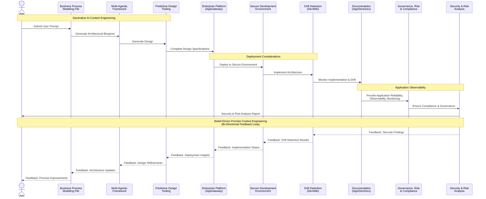

```mermaid
sequenceDiagram
    actor User
    participant BPM as Business Process<br/>Modeling File
    participant MAF as Multi-Agentic<br/>Framework
    participant PDT as Predictive Design<br/>Tooling
    participant EP as Enterprise Platform<br/>(AppGateway)
    participant SDE as Secure Development<br/>Environment
    participant DD as Drift Detection<br/>(DevWiki)
    participant DOC as Documentation<br/>(App/DevDocs)
    participant GRC as Governance, Risk<br/>& Compliance
    participant SRA as Security & Risk<br/>Analysis

    Note over User,PDT: Generative AI Content Engineering
    User->>BPM: Submit User Prompt
    BPM->>MAF: Generate Architectural Blueprint
    MAF->>PDT: Generate Design
    PDT->>EP: Complete Design Specifications

    Note over EP,DD: Deployment Considerations
    EP->>SDE: Deploy to Secure Environment
    SDE->>DD: Implement Architecture
    DD->>DOC: Monitor Implementation & Drift

    Note over DOC,SRA: Application Observability
    DOC->>GRC: Provide Application Reliability,<br/>Observability, Monitoring
    GRC->>SRA: Ensure Compliance & Governance
    SRA->>User: Security & Risk Analysis Report

    Note over User,SRA: Belief-Driven Promise Context Engineering<br/>(Bi-Directional Feedback Loop)
    SRA-->>DD: Feedback: Security Findings
    DD-->>SDE: Feedback: Drift Detection Results
    SDE-->>EP: Feedback: Implementation Status
    EP-->>PDT: Feedback: Deployment Insights
    PDT-->>MAF: Feedback: Design Refinements
    MAF-->>BPM: Feedback: Architecture Updates
    BPM-->>User: Feedback: Process Improvements
```    